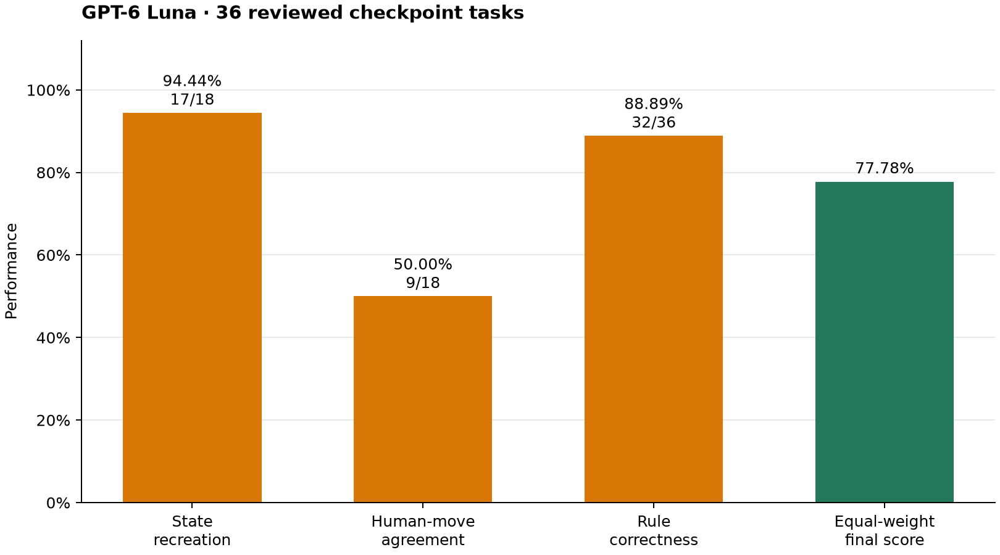
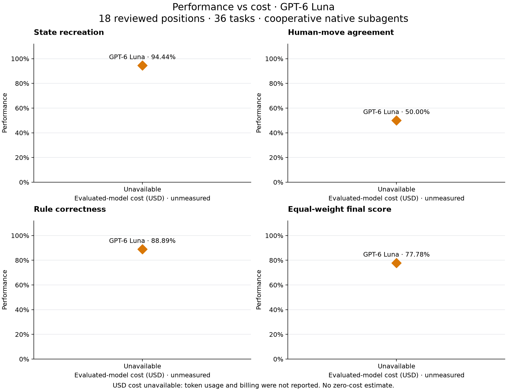

# Yu-Gi-Oh Benchmark

Duelingbook replay sources and reviewed decision benchmarks for testing how
well an LLM plays Yu-Gi-Oh through
[yugioh-harness](https://github.com/SeucheAchat9115/yugioh-harness).
The agent interprets card rules and chooses moves; this repository does not
implement a card-effects engine.

**Status: alpha toolkit.** Replay importing, reviewed-case execution and the
three-KPI artifact scorer and automated metered checkpoint runner are implemented. A [first scoped replay suite](docs/replay-review-stage.md) is prepared. The
[completed Luna run](docs/results/2026-10-09/README.md) reports all
three KPIs on 18 reviewed replay checkpoints. A complete live-duel evaluation
remains pending. The separate [small Edison pilot](docs/edison-pilot.md) measured
state recreation and legality only.
This project is independent of Duelingbook and the Yu-Gi-Oh rights holders.

## Agentic benchmark score

The benchmark evaluates an agent working through the harness, with three equally
weighted KPIs:

| KPI | What it measures | Weight |
| --- | --- | --- |
| State recreation | Does the agent orchestrate a player-declared play and produce the correct game state? | ⅓ |
| Human-move agreement | Does the agent choose the same semantic move as the reviewed human replay? | ⅓ |
| Rule correctness | Is the agent's play legal under the pinned format, banlist and card text? | ⅓ |

**Final score = the average of the three KPI percentages.** A different legal
move can pass rule correctness while failing human-move agreement. The current
plotted result is **GPT-6 Luna** (`gpt-6-luna`). Future runs use the
[evaluation configuration](benchmarks/evaluation-config.json).

The [automated evaluation runner](docs/automated-evaluation.md) sends identical
filtered prompts, receives structured intentions, independently reviews legality,
and executes through the real harness. It records per-call time, tokens and costs
and generates four accuracy/runtime panels plus four accuracy/cost panels.
The [KPI scorer](docs/agentic-kpis.md) also accepts separately collected artifacts.
Missing attempts score zero, while unfinished grading blocks a final score.
A high task score alone does not establish competitive playing strength.

## Scoped replay results



| KPI | GPT-6 Luna |
| --- | ---: |
| State recreation | 94.44% (17/18) |
| Human-move agreement | 50.00% (9/18) |
| Rule correctness | 88.89% (32/36) |
| **Equal-weight final score** | **77.78%** |

All 36 tasks are graded across 18 independently reset positions. The current
plots show only this completed native Luna run; the earlier assisted Sol and
Luna points have been removed. Independent journal replay reproduced the score.



Native subagents did not report tokens or billing, so cost is **unavailable**.
The plot uses an explicitly labeled categorical position, rather than assigning
zero USD. Comparable runtime is also unavailable because collection combined
archived answers with manual preparation and waiting. The
[runtime plots, reproducible summaries and methodology](docs/results/2026-10-09/README.md)
record these limits. This is cooperative checkpoint evaluation with automated
legality reviews; a continuous duel remains unevaluated. The report discloses
five excluded referee-input trials and one corrective player dispatch for an
incorrect input, with zero performance-selected retries.

## Replay dataset and importing

The selected [Aco77 vs sdesowitz02 replay](https://www.duelingbook.com/replay?id=40753-85958923)
now uses the [supplied native JSON](fixtures/duelingbook/aco77-sdesowitz02-2026-10-07.json)
and [native bundle](replays/db-json-40753-85958923) as its primary source:
**554 source plays, two games, 174 review candidates**. It adds private draw
observations for both players, card definitions, shuffle references and absolute
LP updates. The [source registry](benchmarks/sources.json) links the JSON fixture,
bundle, hashes, card references and review candidates. Its identity is
`db-json-40753-85958923`.

The [whole-match review](docs/replay-review-stage.md) covers all 207 work items
across both games. All 185 previously pending items now have dispositions:
14 newly approved, 77 excluded as bookkeeping/substeps and 94 reviewed but blocked.
The suite has **18 scoped checkpoints and 36 tasks**, including the original four.
These are independent resets, not an uninterrupted match. The earlier four-position
cooperative pilot scored 70.83%; the expanded assisted pilots scored **78.70% for
Sol and 54.63% for Luna**. These results do not establish competitive strength.
The user identifies the match as
**Perfect Circle 2007**; historical-text-dependent cases remain provisional and
the native export itself labels the game Unlimited.

For each new match, open the browser inspector’s **Network → Fetch/XHR** tab,
reload the replay and copy the complete **`view-replay` JSON response** to a file.
Supply the replay URL and played format alongside it. Follow the
[step-by-step acquisition guide](docs/acquisition.md), including its coverage
checks. HTML exports and copied duel text are unsupported.

Importing runs offline without runtime dependencies, browser setup or credentials.
Each native play has a numbered, hashed event file and its original source index.
Unknown cards, missing timestamps and manual operations remain available for review.

An orchestrator can import files internally in response to a natural language
request. Duel players do not need to run Python themselves. Maintainer commands:

```sh
git clone https://github.com/SeucheAchat9115/yugioh-benchmark.git
cd yugioh-benchmark
python -m pip install .
yugioh-benchmark convert-json imports/replay.json --source https://www.duelingbook.com/replay?id=40753-85958923 --output replays/my-native-match
yugioh-benchmark inspect replays/db-json-40753-85958923
# Reconstruct reviewer-only observations; these are not scored cases:
yugioh-benchmark extract replays/db-json-40753-85958923 --output inspection/db-json-40753-85958923
# Score a reviewed suite and its trusted run artifacts:
yugioh-benchmark score-kpis suite.json run.json
python -m unittest discover -s tests -v
```

[Offline CI](.github/workflows/ci.yml) tests Python 3.11–3.13 on Linux and Windows and
checks the filtered benchmark bridge against the pinned harness.
Replay conversion and human-move/legality artifact scoring do not require the harness.
State-recreation KPI scoring requires the harness to verify journals. Running
an agent through the bridge requires a separate harness checkout and your own
bounded model transport; see [harness setup](docs/harness-integration.md).

- [Supplying replay data](docs/acquisition.md)
- [Current card names and texts from YGOPRODeck](docs/card-metadata.md)
- [Native JSON importing and coverage](docs/native-json.md)
- [Whole-match review and the first scoped suite](docs/replay-review-stage.md)
- [Extracting states and preparing reviewed cases](docs/extraction.md)
- [Replay bundle format](docs/replay-format.md)
- [Preparing harness decision positions](docs/harness-integration.md)
- [Agentic workflow KPIs and scoring](docs/agentic-kpis.md)
- [Contributing](CONTRIBUTING.md)
- [Release notes and public release preparation](docs/releasing.md)

Raw imports and evaluation runs stay local and ignored. Deliberately selected
source fixtures and reviewed cases may be versioned. Harness game saves belong
in the harness's local storage.

The code and documentation use the [MIT license](LICENSE). Replay fixtures,
derived observations and candidate indexes are source data with separate
[attribution and rights information](THIRD_PARTY_NOTICES.md); they are not
relicensed under MIT. A replay URL records provenance, not a redistribution
license.
