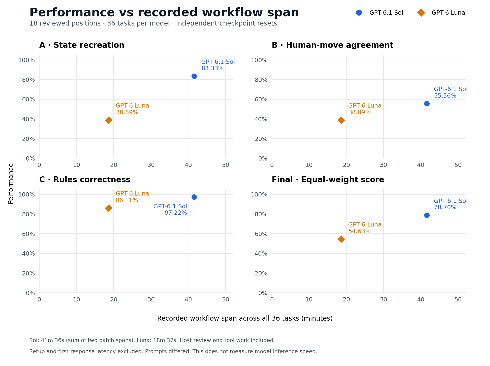

# Sol and Luna replay checkpoint results — 2026-10-08

Requested models: gpt-6-luna and gpt-6.1-sol, through fresh Codex native subagents from the host chat.
No API key or direct provider API calls were used. The runner does not expose
independent provider model/version or usage attestation.

| KPI | GPT-6.1 Sol | GPT-6 Luna |
| --- | ---: | ---: |
| State recreation | 83.33% (15/18) | 38.89% (7/18) |
| Human-move agreement | 55.56% (10/18) | 38.89% (7/18) |
| Rules correctness | 97.22% (35/36) | 86.11% (31/36) |
| **Equal-weight final score** | **78.70%** | **54.63%** |



[Download the four-panel SVG](performance-runtime.svg). Performance comes from the
committed score summaries; the runtime axis comes from the
[reconstructed timestamp summary](runtime-summary.json).

Luna used 36 fresh attempts; Sol used 28 new attempts and 8 compatible earlier attempts.
Both cover 36 tasks across 18 reviewed positions from game 2 of
https://www.duelingbook.com/replay?id=40753-85958923.
No model retries. All 36 initial hashes and replayable journals
verified; repository CLI reproduced the score. Each checkpoint was independently
reset, so this is not one continuous duel or a competitive win-rate estimate.

The moderator task proposes operations for a declared action. Incorrect physical
references, paths and indexes are retained as failures rather than repaired.
The player task independently chooses an intention; the host reviews its legality
and supplies an execution plan. Illegal choices are rejected without state mutation.
Host-only no-op events preserve rejected attempts in journals.

Rules correctness evaluates reviewed YuGiOh legality, not operation-schema accuracy.
A legal intention in a malformed operation can pass rules correctness while failing
state recreation. Concrete proposals to move into occupied zones fail both.
Five Luna legality failures:

- 337-state and 469-state: attempted Set into occupied field slots.
- 338-choice: second Normal Summon/Tribute Summon after allowance already used.
- 368-choice: Diamond Dude excavation effect while that monster is in hand.
- 470-choice: Soul Exchange targeted a nonexistent facedown opponent monster.

This uses cooperative isolation: no inherited history, permitted information only,
and instructions forbidding shared tools/files/network/delegation. No enforced
sandbox or autonomous full default harness instruction stack is claimed.
Host independently adjudicates proposals and controls the sole state writer.

The same reviewed cases and grading method were used for Sol, but manually condensed
delivered prompts are not byte-identical. Luna received an allowed-kind list in every
state prompt; Sol 338-state was affected by a host omission. This comparison is an
illustrative pilot, not a controlled model ranking.

377-choice was a legal pass, but did not explicitly request ending the turn; it does
not match the strict end_turn reference. Stratos's suggested later search at 360-choice
was conditional, and host execution stopped before opponent summon negation.
Public narration is outside the gameplay-state metric. Some narration was corrected
without changing operations; all raw responses are retained.

Historical card text coverage remains incomplete. Effect resolutions and optimal
strategy were not certified; agreeing with one replay does not prove strong play.

Source suite digest:
55ca1fb3c58dd77b84c0a176cc9909a4b5b7a6c0ff597afed608f4ccd6b8aa99
Benchmark PR commit: f6bf899903b1285ec5b0aacdd2bf5776a417b958

See [provenance](provenance.json) for source, instruction, implementation and private run hashes.
[Sol score summary](sol.score.json) and [Luna score summary](luna.score.json) contain
aggregate scores and per-case outcomes only. Raw model logs, authoritative journals
and harness saves remain local, as required by repository policy. These score
summaries are not sufficient to independently rescore the private attempts.

## Runtime reconstruction

All four plots use the **total recorded workflow span across 36 tasks**, not
the time spent on each individual KPI. Runtime comes from the first and last
saved harness action within each execution batch:

| Model / batch | Attempts | Recorded span |
| --- | ---: | ---: |
| Sol, original retained batch | 8 | 9m 14s |
| Sol, expanded fresh batch | 28 | 32m 22s |
| **Sol, sum of the two unrounded spans** | **36** | **41m 36s** |
| **Luna, fresh batch** | **36** | **18m 37s** |

The gap between Sol's two batches is excluded. These spans include host review,
orchestration, tool calls and pauses within a batch. They exclude setup and the
first attempt before its first recorded action. Separate subagent start-to-response
timestamps were not preserved in the surviving artifacts, so model inference
latency cannot be recovered. This is not a controlled model speed comparison.

The timestamp summary includes each batch's bounds and private source-run hash.
The plotting script validates timestamp differences, summed spans and source hashes
against the committed provenance. Points show only the two observed models; no
interpolation, trend line or speed-versus-quality frontier is inferred.

Each plot is also available separately:

| Plot | PNG | SVG |
| --- | --- | --- |
| State recreation | [PNG](performance-runtime-state-recreation.png) | [SVG](performance-runtime-state-recreation.svg) |
| Human-move agreement | [PNG](performance-runtime-human-move-agreement.png) | [SVG](performance-runtime-human-move-agreement.svg) |
| Rules correctness | [PNG](performance-runtime-rule-correctness.png) | [SVG](performance-runtime-rule-correctness.svg) |
| Final score | [PNG](performance-runtime-final-score.png) | [SVG](performance-runtime-final-score.svg) |

## Regenerating the plots

Matplotlib is an optional plotting dependency, not a benchmark runtime
dependency. Install them and run the script from the repository root:

```sh
python -m pip install matplotlib
python docs/results/2026-10-08/plot_results.py
```

The script reads the committed score and runtime summaries and writes the
four-panel figure plus four standalone plots, each in PNG and SVG format.
