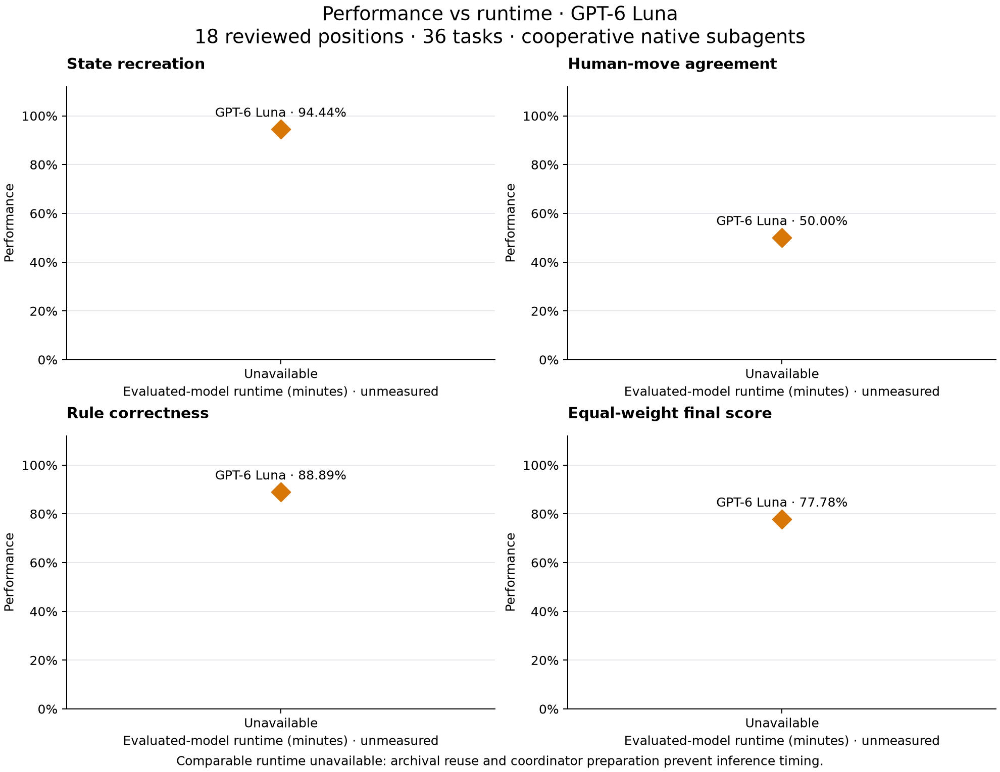

# GPT-6 Luna checkpoint results

The current plots contain only the completed native `gpt-6-luna` run: 36 tasks
across 18 independently reset, reviewed positions. All tasks are graded.


| KPI | Passed / total | Score |
| --- | ---: | ---: |
| State recreation | 17/18 | 94.44% |
| Human-move agreement | 9/18 | 50.00% |
| Rule correctness | 32/36 | 88.89% |
| **Equal-weight final score** | | **77.78%** |

## Performance versus costs


The run used native subagents through the chat subscription. Token usage and
billing were not reported, so evaluated-model and full-pipeline USD costs are
`null`. The categorical **Unavailable** position shows the observed performance
without inventing a numeric cost. It does not represent $0, an allocated
subscription price, or a hypothetical API estimate.

## Performance versus runtime



The run reused archived answers and collected others through manual prompt
preparation. Collector timings include preparation, waiting and cached retrieval;
there is no complete, comparable model-runtime measurement. The old assisted
pilot's time coordinates are therefore removed rather than reused for this run.

## Scope and provenance

Players received filtered checkpoint packets in fresh native subagents. Isolation
was cooperative, with tools and shared files exposed. Independent LLM referees
reviewed initiation legality; approved intentions executed through the persistent
harness. An independent replay of the private journals reproduced the score.
One harness execution failure remains reflected in the results. These scores
measure checkpoint tasks; continuous-duel performance remains unevaluated.

Five referee transport trials and one player trial were excluded for incorrect
input. One fresh player dispatch corrected that input; there were zero retries
selected for gameplay performance. Actual provider versions, usage and costs are
unknown. Prompt-delivery evidence is reconstructed supervisor text, without a
direct provider trace. Earlier guarded dispatch failures remain archived locally.

Only [score summaries](luna.score.json), [measurement availability](measurements.json)
and [provenance hashes](provenance.json) are versioned here. Raw responses, journals,
harness saves and full replay logs remain local and ignored. Historical pilot
summaries are retained [separately](../2026-10-08/README.md) and excluded from all
current plots.

## Regenerate

```sh
python docs/results/2026-10-09/plot_results.py
```

Install the optional plotting dependency with `pip install -e '.[plotting]'` if
needed. The script reads only the committed summaries and writes PNG/SVG versions
of the performance overview, the four-panel runtime and cost figures, and each
individual metric. No API access or private run files are needed.

| Plot | Runtime | Cost |
| --- | --- | --- |
| All four metrics | [SVG](performance-runtime.svg) | [SVG](performance-cost.svg) |
| State recreation | [PNG](performance-runtime-state-recreation.png) | [PNG](performance-cost-state-recreation.png) |
| Human-move agreement | [PNG](performance-runtime-human-move-agreement.png) | [PNG](performance-cost-human-move-agreement.png) |
| Rule correctness | [PNG](performance-runtime-rule-correctness.png) | [PNG](performance-cost-rule-correctness.png) |
| Final score | [PNG](performance-runtime-final-score.png) | [PNG](performance-cost-final-score.png) |
